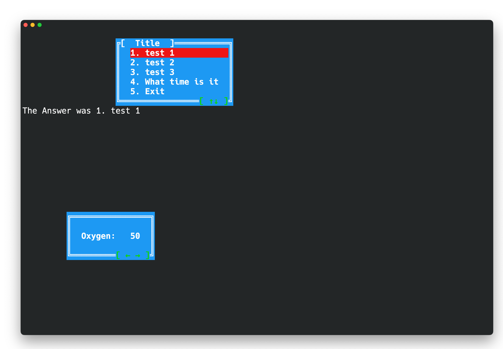

# Go Console UI

### Library for creating terminal windows and prompts. 

### Todo

- Detect the size of the Screen and Adject Accordingly
- Add Some more styles
- Add Input box for Text
- Make the Selector have a prograss bar 
- Mouse Support? 

